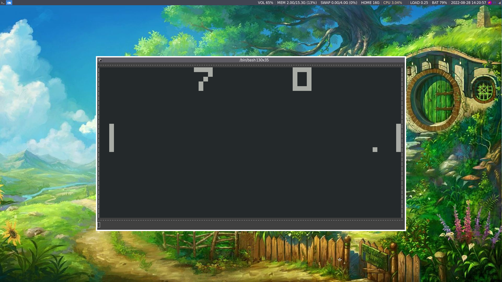

This is a barely functional linux-only chip8 interpreter for the terminal.
The config file gives an example of how to configure keybindings and speed settings for each game.
All settings visible in the config file can be changed in command mode.
To enter command mode press escape.

commands:
- exit => exits the program
- resume => exits command mode
- nanosleep secs nanos => configures nanosleep after every cycle (I am aware that this is not a great solution)
- remap key to => first parameter is key-pressed and second parameter the hex value of the mapping
- view setting => view value of specified setting 

Do not use Ctrl-C to close the program while not in command mode, as the key repeat rate will be messed up and raw mode will still be enabled.
If you happen to use i3, you can run the python script to launch the interpreter (it will make the window look nicer).
